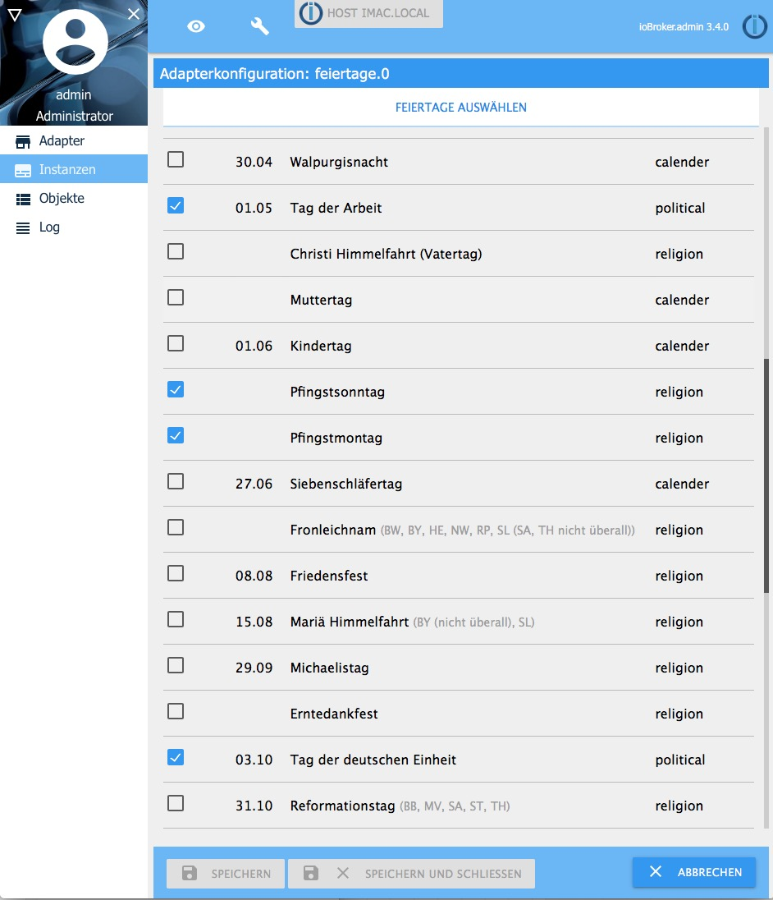

# ioBroker.feiertage

## Beschreibung
Dieser Adapter liefert das Datum, die Dauer bis zu diesem Datum in Tagen und den Namen des nächsten deutschen Feiertages und gibt Auskunft, ob heute, morgen oder übermorgen ein Feiertag ist.  

##  Datenpunkte

## Einstellungen
Feiertage, die bei der Befüllung der Datenpunkte berücksichtigt werden sollen, können ausgewählt werden.

## Aktivierung
Der Adapter startet jeden Tag um Mitternacht. Ein häufigeres Starten ist nicht erforderlich.